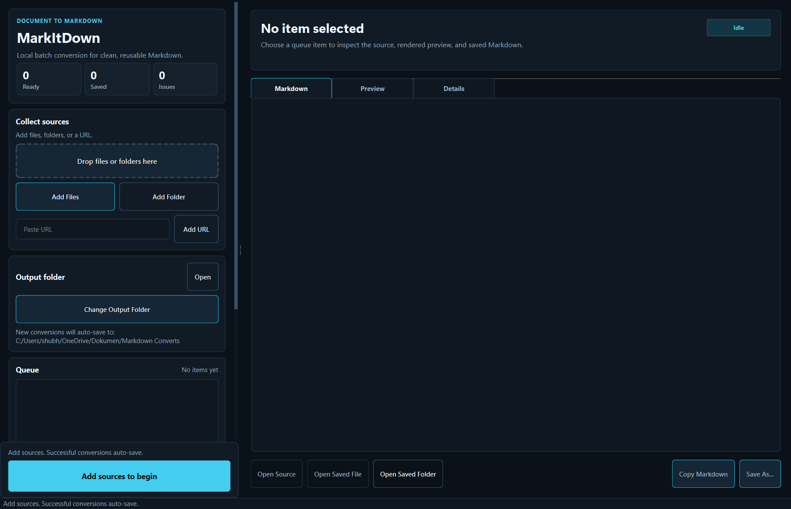
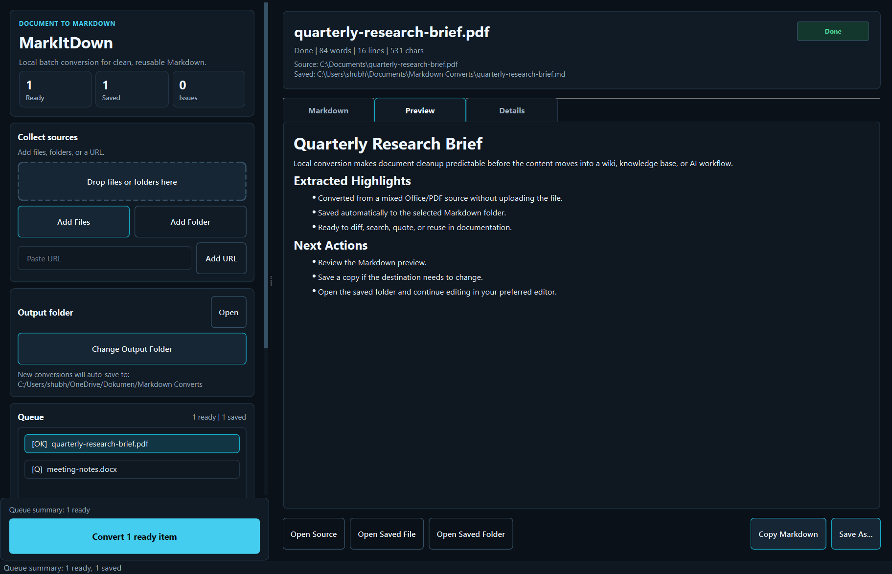

# MarkItDown GUI

[](LICENSE)
[](#quick-start)
[](#tech-stack)

A practical Windows desktop workflow for [Microsoft MarkItDown](https://github.com/microsoft/markitdown). Drop in documents, folders, or URLs, batch-convert them locally, preview the Markdown, and keep every successful conversion in one predictable output folder.





## Why This Exists

`markitdown` is powerful, but real desktop work often starts with messy piles of PDFs, Office files, exported reports, web pages, and folders. The CLI is great for automation; this app focuses on the human workflow around it:

- Collect many sources into one visible queue.
- Convert locally without uploading private files by default.
- Preview rendered Markdown before reusing it.
- Auto-save clean `.md` files into a known folder.
- Retry failed items without rebuilding the whole batch.
- Open the source, saved file, or saved folder in one click.

The goal is simple: make document-to-Markdown conversion usable for research, docs, notes, GitHub wikis, knowledge bases, and AI/RAG preparation.

## Features

- Drag and drop files or folders.
- Add URLs to the same batch queue.
- Background folder scanning for supported files.
- Compact queue with status badges for ready, converting, saved, and failed items.
- Markdown raw view, rendered preview, and conversion details.
- Automatic save to a chosen output folder.
- Retry failed items and clear saved items.
- Optional OpenAI description enrichment for image-heavy documents.
- Dark Windows desktop interface with app icon.
- PyInstaller build and optional Inno Setup installer flow.

## Quick Start

### Run From Source

Requirements:

- Windows 10 or later
- Python 3.11+

```powershell
git clone https://github.com/shubhankarreddy/markitdown-gui.git
cd markitdown-gui
.\setup.bat
.\venv\Scripts\python.exe .\markitdown_app.py
```

### Build The Windows App

```powershell
.\build.bat
```

The app is built to:

```text
dist\MarkItDown\MarkItDown.exe
```

If Inno Setup 6 is installed, `build.bat` also creates an installer under `installer_output\`. Build artifacts are intentionally ignored by Git so the repository stays small.

## Supported Inputs

The app accepts files, folders, and `http`/`https` URLs. Folder drops are scanned for common document and media formats supported by MarkItDown, including:

- PDF, Word, PowerPoint, Excel, Outlook, text, CSV, JSON, XML, HTML, YAML, Markdown
- PNG, JPG, GIF, BMP
- MP3, WAV, MP4
- Jupyter notebooks and ZIP archives

Conversion quality still depends on the source file and MarkItDown's upstream parser support. The app keeps failures visible so they can be retried, inspected, or reported.

## Privacy

By default, files are converted locally on your machine. If you enable OpenAI description enrichment, document content needed for that enrichment may be sent to the configured OpenAI model. Keep that option off for private or sensitive documents unless you are comfortable with that workflow.

## Project Status

The current feature-complete app is the Python/PyQt6 Windows client in `markitdown_app.py`.

There is also an experimental WPF/native Windows prototype under `Native/`. It is useful for future direction, but it is not feature-parity with the PyQt app yet.

## Tech Stack

- Python
- PyQt6
- Microsoft MarkItDown
- PyInstaller
- Inno Setup, optional

## Repository Map

- `markitdown_app.py` - main desktop app
- `requirements.txt` - pinned runtime dependencies and MarkItDown extras
- `build.bat` - Windows build script
- `MarkItDown.spec` - PyInstaller app bundle configuration
- `assets/` - app icon assets
- `docs/screenshots/` - README screenshots
- `Native/` - experimental WPF/native client
- `DESIGN_BRIEF.md` - product and UX direction
- `ROADMAP.md` - planned improvements
- `CONTRIBUTING.md` - contributor guide

## Contributing

Contributions are welcome. The best first issues are usually practical workflow improvements: clearer error messages, better parser recovery, more robust preview behavior, installer polish, and accessibility fixes.

Before opening a pull request:

```powershell
.\venv\Scripts\python.exe -m py_compile .\markitdown_app.py .\Native\MarkItDown.Native\Backend\markitdown_backend.py
```

Please read [CONTRIBUTING.md](CONTRIBUTING.md) and keep changes focused. This project values practical improvements over cosmetic churn.

## Roadmap

Near-term priorities:

- Publish signed release installers.
- Improve automated smoke tests for common file types.
- Add richer conversion diagnostics for missing upstream dependencies.
- Continue the native WPF track once the PyQt workflow is stable.

See [ROADMAP.md](ROADMAP.md) for more detail.

## License

MIT. See [LICENSE](LICENSE).
